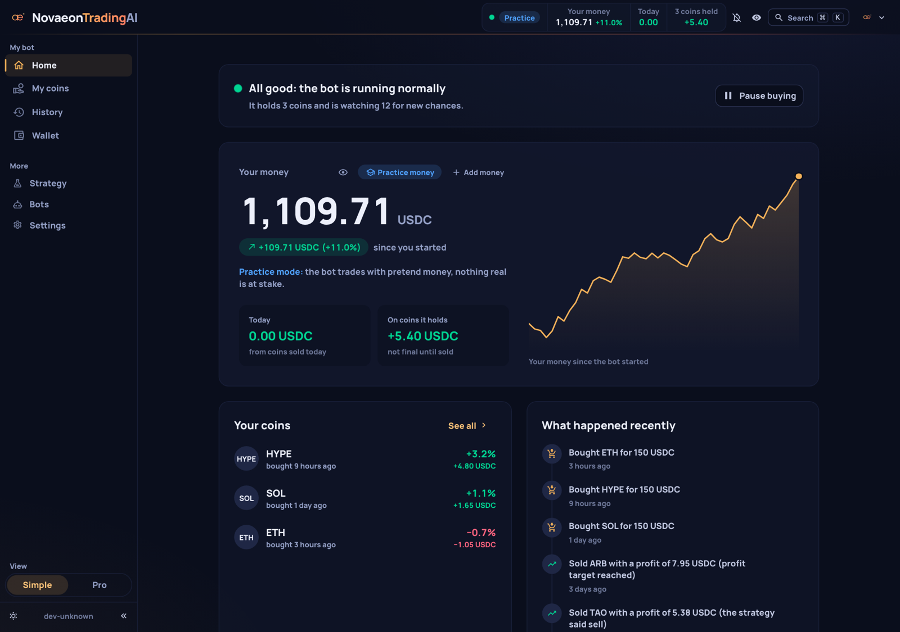
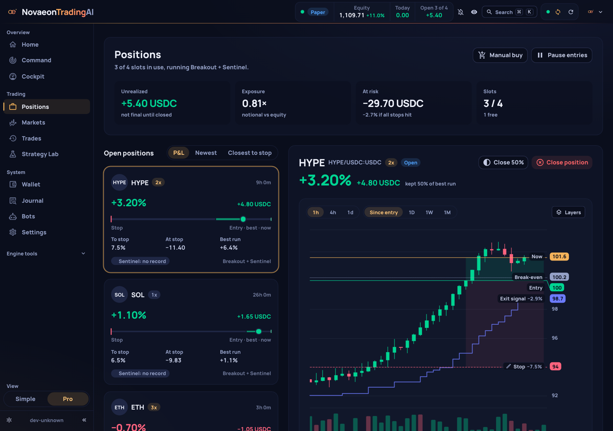
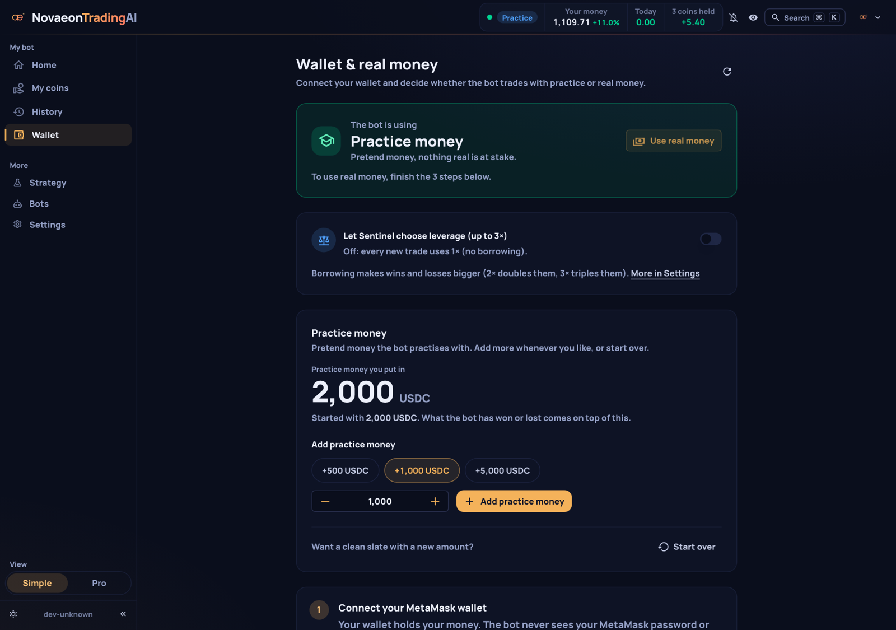
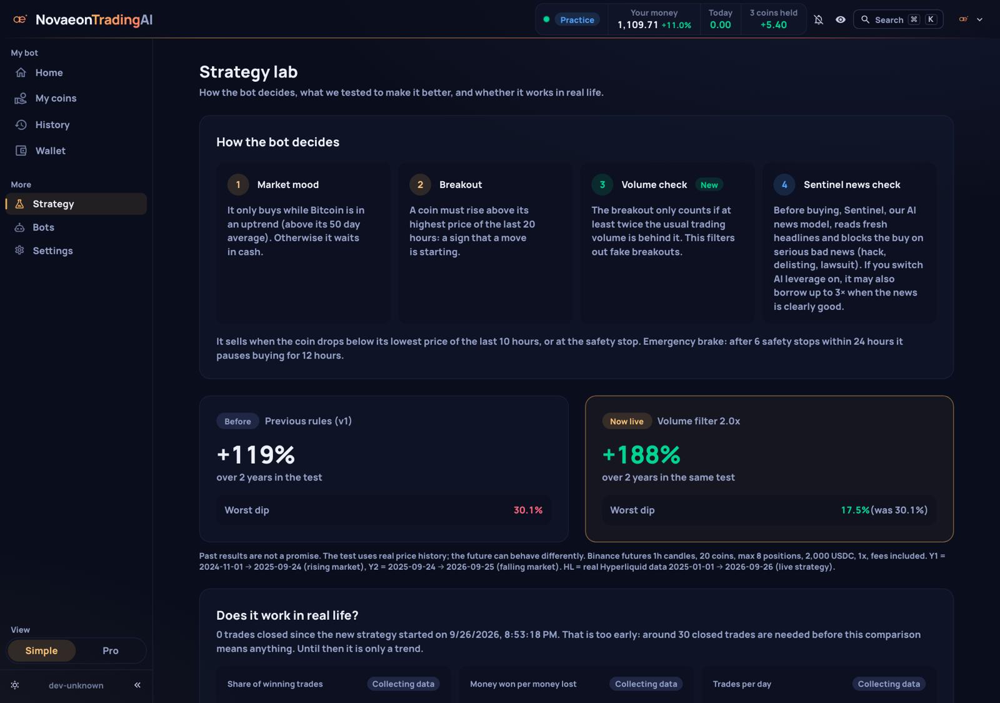
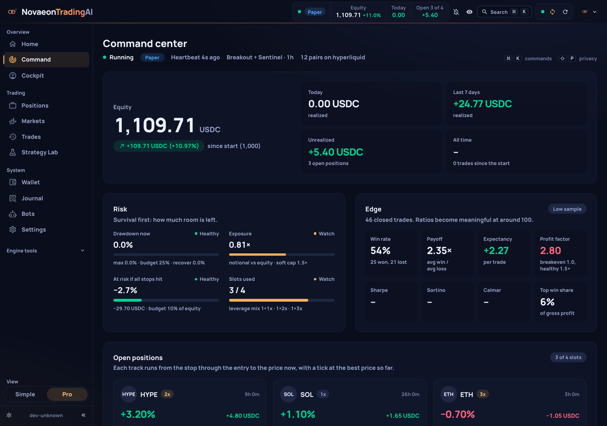
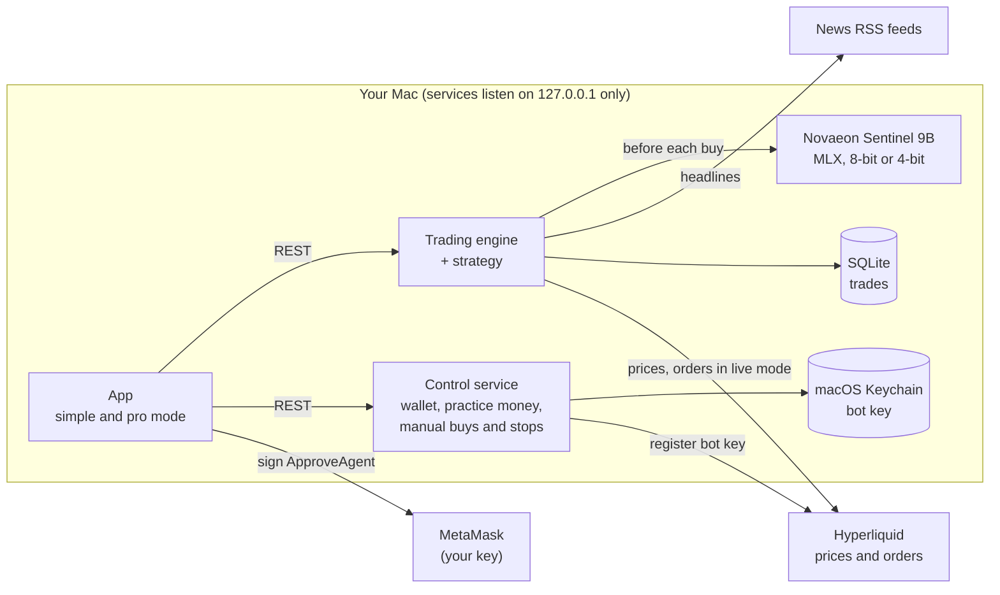

# NovaeonTradingAI

**A crypto trading bot for your Mac that reads the news before it buys.** It trades one simple, tested breakout
strategy on Hyperliquid, asks a local AI model (Novaeon Sentinel 9B) whether there is serious bad news about a coin
before every purchase, and shows everything in a clear app. It starts with practice money, runs entirely on your own
computers, and your wallet key never leaves MetaMask. New in 1.2: the bot checks every 15 minutes instead of every
hour, sells half of a position at +20%, its exit level only rises while it holds a coin (1.2.1), and the position
chart has a right-click menu. Since 1.1 the bot also runs on
Linux and, in beta, on Windows, with Sentinel on your Mac in the same private network.

By [Novaeon Studio](https://novaeon.studio). Free and open source (GPL-3.0).

<p>
  <a href="https://github.com/NovaeonStudio/novaeon-trading-ai/releases/download/v1.2.1/NovaeonTradingAI-1.2.1.dmg"></a>
  <a href="https://huggingface.co/NovaeonStudio/novaeon-sentinel-9b"></a>
</p>

Apple Silicon Mac, macOS 14 or newer. Linux and Windows (beta): see [Install](#install). All versions:
[Releases](https://github.com/NovaeonStudio/novaeon-trading-ai/releases).

> **Risk warning.** Trading crypto can lose you money, quickly. Backtests and practice results do not guarantee
> future results. This is not financial advice. Read the [disclaimer](docs/DISCLAIMER.md) before using real money.

| | |
|---|---|
|  |  |
|  |  |



<sub>Screenshots use sample data in practice mode.</sub>

## What it does

- **Trades one strategy, openly.** Breakouts above the 20-hour high on 20 large coins, checked every 15 minutes,
  only while Bitcoin is in an uptrend, only on strong volume. Every rule is in [docs/STRATEGY.md](docs/STRATEGY.md), with the backtest numbers and their
  drawdowns.
- **Checks the news first.** Before each purchase, Novaeon Sentinel 9B reads the last 48 hours of headlines about
  the coin and blocks the trade if they report a hack, delisting, lawsuit, chain halt or similar. The model runs on
  your Mac; headlines are not sent to a cloud AI.
- **Starts with practice money.** A new install trades 2,000 USDC of practice money against live prices. You can
  add practice money or start over on the Wallet page.
- **Goes live only when you decide.** Connect MetaMask, allow a trading-only bot key, set a spending cap, type
  "REAL MONEY". The bot key can trade but cannot withdraw.
- **Explains itself.** Simple mode answers three questions at a glance: Is the bot OK? How is my money doing? What
  is it doing? Pro mode adds charts with entry, stop, break-even and liquidation lines, a trade journal, and a
  strategy page that compares live results with the backtest.
- **Lets you step in.** Sell a position, buy more, or move a stop up. Stops can only be tightened, never loosened.
- **Stays at 1× leverage unless you turn on AI leverage.** With AI leverage on, Sentinel may choose 2× or 3× on
  clearly good news. It is off by default and not available on 8 GB Macs.

## Runs on any Apple Silicon Mac, even with 8 GB

The installer checks your Mac's memory and downloads the Sentinel build that fits.

| Your Mac | Sentinel build | Download | News filter on 495 held-out test cases | AI leverage |
|---|---|---|---|---|
| 16 GB or more | 8-bit | 8.4 GB | Same quality as the full model: caught 23 of 28 bad-news cases, blocked 8 of 467 harmless ones | Available (off by default) |
| 8 GB | 4-bit (distilled) | 4.5 GB | Same filter quality as the full model: caught 23 of 28 bad-news cases, blocked 6 of 467 harmless ones | Locked off (its leverage picks are less precise) |

For comparison, the full-precision model catches 24 of 28 and blocks 6 harmless cases. Method and all numbers:
[docs/SENTINEL.md](docs/SENTINEL.md#running-on-your-mac-8-bit-and-4-bit).

**Honest speed note for 8 GB Macs:** the 4-bit model uses about 5 GB of memory while idle. In our stress test, with
495 news checks sent back to back, it peaked at about 7.6 GB. The bot works, but the Mac has little room left: close
heavy apps and expect other apps to feel slower. A news check only happens right before a purchase (a few times a
day), so trading itself is not slowed down. Seconds per check on a base 8 GB M1/M2 have not been measured yet.

Intel Macs are not supported as Sentinel machines. On Linux and Windows, the bot runs on its own and asks Sentinel on
your Mac over your private network (see [split setup](#split-setup-bot-on-linux-or-windows-sentinel-on-your-mac)).

## Install

| | macOS | Linux | Windows (beta) |
|---|---|---|---|
| Computer | Apple Silicon Mac, macOS 14+, 8 GB memory or more | x86_64 or arm64, a glibc distribution with systemd (e.g. Ubuntu, Debian, Fedora), 2 GB memory for the bot | Windows 10 (2004 or newer) or 11, 64-bit, WSL2 |
| Free disk | about 12 GB | about 4 GB for the bot; 26 to 30 GB with Sentinel on this machine | as Linux |
| Background services | launchd agents | systemd user services | systemd user services inside WSL2; run while WSL runs |
| Sentinel (news check), default | on this Mac (`mlx`) | `remote` if you give a URL; `cuda` if an NVIDIA GPU with 24 GB is found; otherwise the installer asks (without a terminal: `off`) | as Linux |
| Sentinel, other choices | `remote`, `off` | `cuda` (experimental), `cpu` (experimental, not recommended), `off` | as Linux |
| Bot key for real money | macOS Keychain | encrypted systemd user credential (needs systemd 256+, e.g. Ubuntu 25.04+, Debian 13, Fedora 41+) | as Linux, inside WSL |
| Status | stable | new in 1.1.0, tested on Ubuntu 26.04 (x86_64) | beta: not yet tested on a real Windows PC |

### macOS

**One line** (in Terminal):

```bash
curl -fsSL https://raw.githubusercontent.com/NovaeonStudio/novaeon-trading-ai/main/install.sh | bash
```

Prefer to read it first? Download [`install.sh`](install.sh), read it, then run `bash install.sh`.

**Or the app:** download `NovaeonTradingAI-<version>.dmg` from the
[latest release](https://github.com/NovaeonStudio/novaeon-trading-ai/releases/latest) and drag the app to
Applications. The app is not signed with an Apple developer certificate, so macOS blocks the first launch:
- **macOS 14:** right-click the app and choose **Open**, then confirm.
- **macOS 15 and later:** double-click the app once, close the warning, then open **System Settings → Privacy &
  Security**, scroll down and click **Open Anyway** next to NovaeonTradingAI.

If you prefer not to do this, use the one-line install above instead. On first launch it runs the same installer in Terminal; later launches open the app in your browser. Each
release lists SHA-256 checksums of its files.

What the installer does:

- needs macOS 14 or newer, an Apple Silicon Mac with at least 8 GB of memory, and about 12 GB of free disk space;
  no Homebrew, no Xcode tools, no admin password;
- installs everything into `~/NovaeonTradingAI` (its own Python, the trading engine, the app) and starts the
  engine, the control service and Sentinel as background services, so trading continues when the browser is closed;
- downloads the Sentinel build for your Mac from
  [Hugging Face](https://huggingface.co/NovaeonStudio/novaeon-sentinel-9b);
- creates a random login password (shown at the end, copied to your clipboard, and kept in
  `~/NovaeonTradingAI/login.txt`);
- starts in practice mode at 1× leverage, reachable only from your own Mac, and opens the app in your browser;
- asks once whether it may count the install anonymously. Only if you say yes, it sends the app version, the macOS
  major version and a memory size class, once. No IDs. (Linux and Windows installs are never asked or counted.)

### Linux

```bash
# bot here, Sentinel on your Mac (see "Split setup" below):
curl -fsSL https://raw.githubusercontent.com/NovaeonStudio/novaeon-trading-ai/main/install.sh | bash -s -- --sentinel remote --sentinel-url http://<your-mac>:8010
# or let the installer decide (NVIDIA GPU with 24 GB -> Sentinel on it; otherwise it asks):
curl -fsSL https://raw.githubusercontent.com/NovaeonStudio/novaeon-trading-ai/main/install.sh | bash
```

Same defaults as on the Mac: its own Python in `~/NovaeonTradingAI`, practice money, a random password, the app on
127.0.0.1 only, 1× leverage. No root rights are needed. The services are systemd *user* services; the installer
offers to turn on "linger" for your user so they keep running after you log out and start with the computer
(otherwise: `sudo loginctl enable-linger $USER`).

On a server without a screen, open the app through an SSH tunnel from your own computer (the app and its wallet
service use two ports): `ssh -L 8081:127.0.0.1:8081 -L 8082:127.0.0.1:8082 you@server`, then open
http://127.0.0.1:8081.

Sentinel on this Linux machine is **experimental**:
- `--sentinel cuda`: an NVIDIA GPU with 24 GB of memory (e.g. RTX 3090/4090, L4, A10), about 20 GB of main memory
  while the model loads, about 30 GB of disk. It runs the full-precision model (bf16) with Kev's PyTorch backend.
  Tested on NVIDIA hardware only with a small Kev model so far, not yet with the 9B model. GPUs with 30 GB or more
  also get Kev's CUDA graphs; a C compiler (`build-essential`) enables faster GPU kernels.
- `--sentinel cpu`: about 20 GB of main memory (24 GB or more recommended). **Not recommended:** on a typical CPU
  without fast bf16 support (AMX or AVX512-BF16) one news check takes about 1 to 3 minutes, and the bot waits that
  long before each buy.

### Windows (beta)

In PowerShell:

```powershell
irm https://raw.githubusercontent.com/NovaeonStudio/novaeon-trading-ai/main/installer/windows/install.ps1 | iex
```

The Windows installer sets up the Linux version inside WSL2 (Ubuntu): it checks Windows, installs Ubuntu in WSL if
needed (administrator rights once, maybe a restart: then open Ubuntu once to create your Linux user and run the line
again), turns on systemd in WSL, and runs the Linux installer. Options go into environment variables first, e.g.
`$env:NOVAEON_SENTINEL_MODE="remote"; $env:NOVAEON_SENTINEL_URL="http://<your-mac>:8010"`.

- The app is at http://localhost:8081 in your Windows browser.
- The bot only runs while WSL runs and Windows is awake. The installer can add a scheduled task (opt-in) that starts
  WSL when you log in and keeps it running in the background; remove it with `install.ps1 -RemoveStartAtLogon` or in
  Task Scheduler.
- Manage it with `wsl -d Ubuntu -- ~/NovaeonTradingAI/bin/novaeon status` (or `start`, `stop`, `logs`, `password`,
  `update`, `uninstall`).
- Real money inside WSL uses the Linux key store, which needs systemd 256 or newer in the distribution (Ubuntu 25.04
  or newer). On Ubuntu 24.04 practice mode works, but connecting a wallet for real money stops with an error.
- **Beta:** we have not tested this on a real Windows PC yet. Please report problems.

### Split setup: bot on Linux or Windows, Sentinel on your Mac

The bot needs little: a small Linux server or a Windows PC is enough. Sentinel needs an Apple Silicon Mac (or a big
NVIDIA GPU). Put both in one private network; [Tailscale](https://tailscale.com) is the easy way.

1. **On the Mac:** install Sentinel only (or use a normal Mac install: it already runs Sentinel on port 8010):
   ```bash
   curl -fsSL https://raw.githubusercontent.com/NovaeonStudio/novaeon-trading-ai/main/install.sh | bash -s -- --sentinel-only
   ```
2. **Share it in your tailnet** (on the Mac, with Tailscale installed on both machines):
   `tailscale serve --bg --tcp 8010 tcp://127.0.0.1:8010`. The Mac's Tailscale address is shown by `tailscale ip -4`.
3. **On the Linux or Windows machine:** install with `--sentinel remote --sentinel-url http://<mac's Tailscale address>:8010`
   (Linux line above; on Windows set `NOVAEON_SENTINEL_MODE` and `NOVAEON_SENTINEL_URL` first). The installer checks
   that Sentinel answers.

**Sentinel has no login.** Anyone who can reach its port can use it, so keep it in a private network (Tailscale) and
never forward it to the internet. `--sentinel-only` listens on 127.0.0.1 only; `NOVAEON_SENTINEL_BIND=<address>`
makes it listen elsewhere (opt-in, with a warning). The Mac has to be on and awake: while Sentinel does not answer,
the bot keeps trading at 1× without the news check and notes that in its decision log.

### After installing

`~/NovaeonTradingAI/bin/novaeon` controls everything: `status`, `start`, `stop`, `logs`, `password`, `update`,
`uninstall`. Running the install command again updates an existing install and keeps your settings and trades;
`novaeon update` does the same and takes installer options, e.g. `novaeon update --sentinel remote --sentinel-url
http://<mac>:8010` to move Sentinel to another machine. `uninstall` asks whether to keep your trade history; the bot
key (Keychain or systemd credential) is never deleted automatically.

## First steps

1. **Open the app** (the installer opens it for you) and sign in with the password it showed you.
2. **Watch it practice.** The bot trades practice money against real, live prices. Positions, profits and AI
   decisions look exactly like the real thing.
3. **Add practice money** on the **Wallet** page if you want a bigger practice balance, or **start over** with a
   fresh practice account (the old history is kept).
4. **Check the Strategy page.** It compares live results with the backtest. Wait for about 30 closed trades
   before judging anything; fewer trades are mostly noise.

### Going live (optional)

Real money runs on [Hyperliquid](https://hyperliquid.xyz) (USDC perpetual futures, isolated margin), connected
through MetaMask:

1. Deposit USDC into your Hyperliquid account. Hyperliquid only accepts a bot key after a deposit.
2. On the **Wallet** page, click **Connect MetaMask**.
3. The app creates a **bot key** (Hyperliquid calls it an "API wallet") and stores it in your Mac's Keychain (on
   Linux: an encrypted systemd user credential that only your user on that machine can read).
   MetaMask asks you to sign one message that allows this key to trade for your account.
   - Your MetaMask key never leaves MetaMask. The app never sees it.
   - The bot key can place and cancel orders. **It cannot withdraw or transfer your funds.**
   - You can remove the bot's permission at any time on Hyperliquid's API page, or disconnect the wallet in the app.
4. Choose how much the bot may use (at least 20 USDC, at most your balance), confirm the warnings and type
   `REAL MONEY`.
5. In live mode, stop-losses are also placed on the exchange, so open positions stay protected when your
   computer is off. Switching back to practice is only possible after all real positions are sold.

Start small. Only use money you can afford to lose.

## How the strategy works

Checked against the code in [`bot/strategies/`](bot/strategies/). Full rules and research:
[docs/STRATEGY.md](docs/STRATEGY.md).

- **Market:** 20 large coins on Hyperliquid (BTC, ETH, SOL, BNB, XRP, ADA, DOGE, AVAX, LINK, NEAR, ZEC, ONDO, ENA,
  LTC, TAO, SUI, UNI, ARB, WLD, AAVE), 15-minute candles, long only, at most 8 positions, money split across free
  slots. All windows below are in hours, so a check every 15 minutes keeps the same time horizon.
- **Only in an uptrend:** new trades only while Bitcoin's daily close is above its 50-day exponential average
  (EMA50). When Bitcoin closes below it, the bot sells and waits in cash.
- **Buy:** a 15-minute close breaks above the highest high of the previous 20 hours, on at least twice the average
  volume of the last 20 hours.
- **News check:** Sentinel blocks the purchase if P(major negative news) ≥ 0.30. No recent headlines about the coin
  means no check.
- **Take-profit:** once the price is 20% above the entry, the bot sells half; the other half keeps running.
- **Sell:** a 15-minute close falls below the lowest low of the previous 10 hours, or the Bitcoin trend flips.
  While a trade is open this exit level only rises: it follows the price up and never steps down again.
- **Stop-loss:** 10% of the position's margin (at 1× that is a 10% price drop). You can tighten it by hand.
- **Emergency brake:** after 6 stop-losses within 24 hours, no new purchases for 12 hours.
- **AI leverage (opt-in):** 2× if P(clearly positive news) ≥ 0.50; 3× if ≥ 0.75 and Bitcoin's daily close is at
  least 5% above its EMA50. Otherwise 1×. Never more than 3×.
- **If Sentinel is not reachable:** the bot keeps trading at 1× without the news check (fail-open) and records that
  in the decision log.

**Backtest of these rules** (1×, 20 coins, 8 slots, 2,000 USDC start, trading fees and funding included; the news
filter and AI leverage cannot be backtested and are not part of these numbers):

| Period | Data | Return | Max drawdown | Trades | Win rate | Profit factor |
|---|---|---|---|---|---|---|
| 2024-11-01 to 2025-09-24 | Binance USDT futures | +46.9% | 18.5% | 984 | 38% | 1.19 |
| 2025-09-24 to 2026-09-25 | Binance USDT futures | +105.5% | 10.7% | 518 | 39% | 2.31 |

There is no Hyperliquid row for 15-minute candles: Hyperliquid serves only about 5,000 candles per coin, about 50
days at 15 minutes. Compared with the same rules on 1-hour candles, 15 minutes did better in three of four
half-years and clearly worse in the choppy first half (Nov 2024 – Apr 2025); see
[docs/STRATEGY.md](docs/STRATEGY.md#why-these-rules).

Most trades lose; the strategy lives on a few large moves. Expect long flat or losing stretches and drawdowns of
20% or more. **Past results do not guarantee future results. Not financial advice.**

## Novaeon Sentinel 9B

Sentinel is the news judge. It is a fine-tune of [Kev-9B](https://huggingface.co/jaredpalmer/kev-9b) by Jared
Palmer, which is built on [Qwen3.5-9B-Base](https://huggingface.co/Qwen/Qwen3.5-9B-Base). It does not write text:
it reads the headlines and answers two typed questions with probabilities. Is there major negative news about this
coin? Is the outlook clearly positive, neutral or mixed, or negative?

- Model and card: [NovaeonStudio/novaeon-sentinel-9b](https://huggingface.co/NovaeonStudio/novaeon-sentinel-9b)
  (Apache-2.0)
- How it was trained and tested, and how to reproduce it: [docs/SENTINEL.md](docs/SENTINEL.md)
- Training pipeline and labeling guide: [`novaeon-kev/`](novaeon-kev/). The raw training dataset is not published.

Why fine-tune: on 248 held-out test cases the untuned Kev-9B flagged 26 harmless cases as major bad news and was
right about "clearly positive" only 41% of the time. Sentinel flagged 4 harmless cases and was right about
"clearly positive" 83% of the time. At the bot's settings, across 495 held-out cases, it catches 24 of 28 bad-news
cases and blocks 6 of 467 harmless ones.

## Safety and risk

- Practice mode, 1× leverage and local-only access are the defaults.
- Real money needs four deliberate steps: deposit, MetaMask signature, spending cap, typed confirmation.
- The bot key lives in the macOS Keychain (Linux: an encrypted systemd user credential) and cannot withdraw. See
  [docs/SECURITY.md](docs/SECURITY.md).
- The bot only trades while the computer it runs on is on and awake. In live mode, stop-losses also sit on the
  exchange.
- Sentinel's model server has no login: in a split setup, keep it in a private network (Tailscale).
- Sentinel can be wrong in both directions: it can miss bad news, and it can block good trades.
- Leverage multiplies losses as well as gains.
- Hyperliquid is a decentralized exchange; check that using it is legal where you live. Taxes are your
  responsibility.

Read the full [disclaimer](docs/DISCLAIMER.md).

## Architecture



In a [split setup](#split-setup-bot-on-linux-or-windows-sentinel-on-your-mac) the engine and the control service run
on a Linux machine (or in WSL2 on Windows) and ask Sentinel on your Mac over your private network. More detail:
[docs/ARCHITECTURE.md](docs/ARCHITECTURE.md).

## Repository layout

| Path | What it is |
|---|---|
| `src/`, `public/`, `tests/`, `e2e/` | The app (Vue 3, TypeScript, Nuxt UI, ECharts) and its tests |
| `bot/strategies/` | The strategy |
| `bot/bin/` | Control service, start script, watchdog, data tools |
| `install.sh`, `installer/` | Installer for macOS and Linux, `installer/windows/install.ps1` for Windows (WSL2), `.dmg` build |
| `bot/config/` | Configs without keys (`dry_run: true`) |
| `novaeon-kev/` | Sentinel training pipeline, labeling guide, evaluation, metrics, model card |
| `docs/` | Strategy, Sentinel, architecture, security, disclaimer, contributing |

## Development

Requirements: Node.js 22 or newer (CI uses 24 and 26) and pnpm (the version is pinned in `package.json`;
`corepack enable` picks it up).

```bash
pnpm install --frozen-lockfile
pnpm run dev                 # app with hot reload
pnpm run typecheck
pnpm run lint
pnpm run test:unit
pnpm run build               # production build in dist/
pnpm run test:e2e-chromium   # browser tests (needs Google Chrome)
```

The bot side is Python 3.12. Backtests, the Sentinel pipeline and the MLX builds are described in
[docs/STRATEGY.md](docs/STRATEGY.md) and [docs/SENTINEL.md](docs/SENTINEL.md). Contributions are welcome: see
[CONTRIBUTING](docs/CONTRIBUTING.md) and the [Code of Conduct](docs/CODE_OF_CONDUCT.md). Please report security
issues privately, as described in [SECURITY](docs/SECURITY.md).

## License

- App, bot and scripts: **GPL-3.0**, see [LICENSE](LICENSE) and [NOTICE](NOTICE). Copyright (C) 2026 Novaeon
  Studio and contributors.
- Novaeon Sentinel 9B weights: **Apache-2.0**, like Kev-9B and Qwen3.5-9B-Base, which they are built on.
- The Novaeon name and logo are not licensed for use in other products.

## Built on

NovaeonTradingAI stands on open-source work, and we are grateful for it:

- The app is a heavily modified fork of [FreqUI](https://github.com/freqtrade/frequi) (GPL-3.0).
- The trading engine is [Freqtrade](https://github.com/freqtrade/freqtrade) (GPL-3.0); our strategy and a small
  engine patch run on top of it.
- Sentinel is fine-tuned from [Kev-9B](https://huggingface.co/jaredpalmer/kev-9b) and served with
  [Kev](https://github.com/jaredpalmer/kev) by Jared Palmer (Apache-2.0), built on
  [Qwen3.5-9B-Base](https://huggingface.co/Qwen/Qwen3.5-9B-Base) by the Qwen team (Apache-2.0). The Mac builds use
  [MLX](https://github.com/ml-explore/mlx).

NovaeonTradingAI is independent and not affiliated with or endorsed by these projects.

## Credits

Made by Novaeon Studio. Market data and trading via Hyperliquid. News from the public RSS feeds of CoinDesk,
Cointelegraph, Decrypt and The Block, and from public Google News RSS searches.
