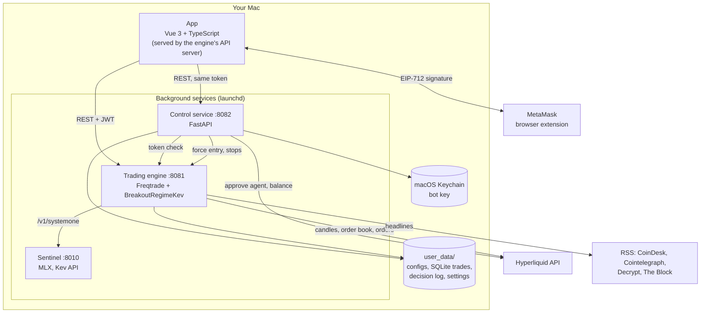
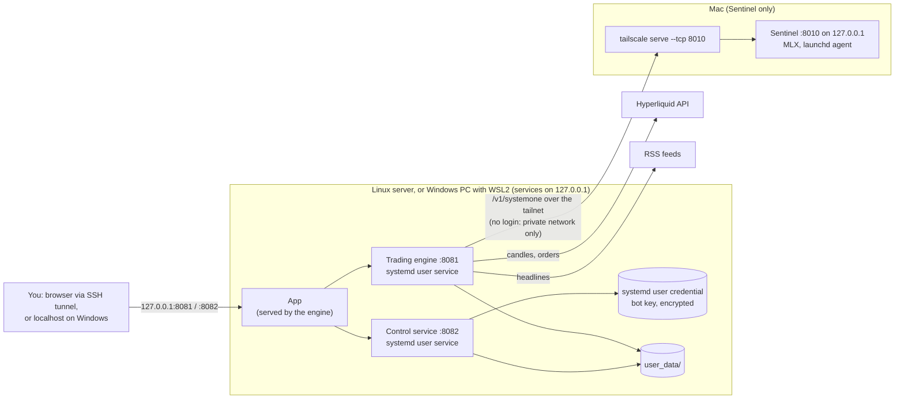
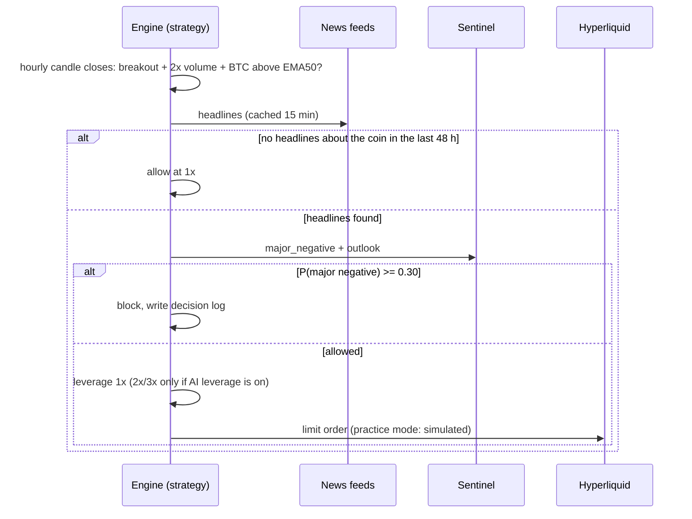
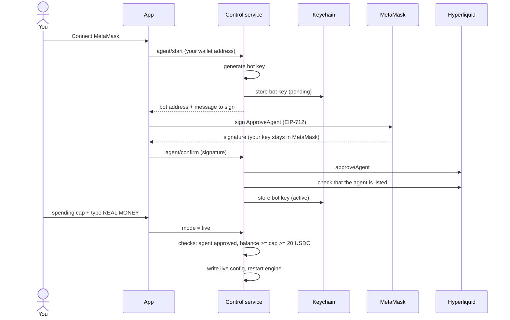

# Architecture

NovaeonTradingAI is four local programs that talk over HTTP on `127.0.0.1`, plus two outside services
(Hyperliquid and public news feeds). Nothing runs in a Novaeon cloud. On a Mac all four run on the Mac (below); in a
[split setup](#split-setup) the bot runs on Linux (or in WSL2 on Windows) and Sentinel on a Mac in the same private
network.

## Components

### App (`src/`)

Vue 3, TypeScript, Pinia, Nuxt UI, Tailwind CSS and ECharts, built with Vite into `dist/`. The engine's API server
serves the built files, so the app and the engine share one origin. Two modes:

- **Simple mode** (default): Home, My coins, History, Wallet, Strategy. Plain language, no trading jargon.
- **Pro mode**: Command Center, Cockpit, Positions (trade chart with entry, break-even, stop, liquidation and
  strategy levels; buy more; move stop), Markets, Trades, Strategy Lab, Journal and engine tools.

It is an installable web app (PWA) with browser notifications and a privacy mode that hides amounts.

### Trading engine (`bot/`)

[Freqtrade](https://github.com/freqtrade/freqtrade) 2026.8 runs the strategy `BreakoutRegimeKev`
([STRATEGY.md](STRATEGY.md)). Its REST API listens on `127.0.0.1:8081` and requires a login (JWT).

- `bot/bin/run-bot.sh` starts the engine in the mode stored in `user_data/mode.json`:
  - **practice**: `dry_run`, a practice balance from `user_data/practice.json`, and a SQLite database per practice
    run (starting over creates a fresh database; the old one is kept);
  - **live**: `user_data/live.json` (`dry_run: false`, the spending cap as `available_capital`, stop-losses on the
    exchange), a separate database, and the bot key read from the Keychain into the engine's environment. Without a
    key it refuses to start instead of silently falling back to practice.
- `installer/lib/ensure-engine-patches.sh` (installed as `bin/ensure-engine-patches.sh`) re-applies one small engine patch after updates: a larger SQLite connection
  pool, because the default pool could be exhausted under concurrent app requests and stall the trading loop.
- `bot/bin/watchdog.py` is a read-only monitor that reports only changes: bot not responding, stopped, emergency
  brake on, drawdown of 15% or more, serious errors, engine patch missing.

### Control service (`bot/bin/control.py`)

A small FastAPI service on `127.0.0.1:8082` for everything the engine does not do itself. It accepts the same
bearer token the app uses for the engine and verifies it against the engine, so there is no second login. Every
state change is appended to an audit log.

| Area | Endpoints |
|---|---|
| Status | `GET /control/status`, `GET /control/balance/{address}` |
| Wallet | `POST /control/agent/start`, `POST /control/agent/confirm`, `POST /control/wallet/forget` |
| Practice money | `GET /control/practice`, `POST /control/practice/add`, `POST /control/practice/reset` |
| Mode switch | `POST /control/mode` (practice ↔ live, with all live-mode checks) |
| Manual trading | `POST /control/buy`, `GET /control/stops`, `POST /control/trades/{id}/stop` |
| Chart levels | `GET /control/levels`, `GET /control/trades/{id}/levels` |
| Settings | AI leverage on/off and whether this Mac allows it |

### Sentinel (`novaeon-kev/`)

The MLX build of [Novaeon Sentinel 9B](SENTINEL.md) (8-bit on Macs with 16 GB or more, 4-bit on 8 GB Macs), served
with Kev's server on `127.0.0.1:8010` (`/v1/systemone`). The strategy calls it once per new position, at most every
2 minutes per coin. If it does not answer, the bot trades at 1× without the news check.

Where it runs is the installer's *Sentinel mode*, passed to the engine as `NOVAEON_SENTINEL_URL`:

| Mode | Sentinel | Engine asks |
|---|---|---|
| `mlx` (macOS default) | this Mac, MLX package (`mlx-8bit` / `mlx-4bit`) | `http://127.0.0.1:8010/v1/systemone` |
| `remote` | another machine in your private network | the URL you gave, e.g. `http://100.x.y.z:8010/v1/systemone` |
| `cuda` (experimental) | this machine's NVIDIA GPU: the LoRA run (`lora/` on Hugging Face) on Qwen3.5-9B-Base, Kev's PyTorch backend, bf16 | `http://127.0.0.1:8010/v1/systemone` |
| `cpu` (experimental, not recommended) | the same on the processor | `http://127.0.0.1:8010/v1/systemone` |
| `off` | nowhere | `off`: no call, every entry at 1× without the news check |

## Split setup

The bot needs little; Sentinel needs an Apple Silicon Mac (or a 24 GB NVIDIA GPU). The split setup puts each where it
fits. This is how the reference installation runs: engine and control service on a small Linux server, Sentinel on a
Mac, both in one Tailscale network.

- The engine only sends Sentinel the coin name and public headlines; no keys, balances or trades.
- Sentinel keeps listening on `127.0.0.1` on the Mac; `tailscale serve --tcp` makes that one port reachable inside
  your tailnet only. Binding Sentinel to another address (`NOVAEON_SENTINEL_BIND`) is possible but opt-in.
- If the Mac is off, asleep or unreachable, the check fails after a connection error or at most 45 seconds and the
  bot trades at 1× without the news check (logged as `kev_unavailable` in `kev_decisions.jsonl`).
- The bot machine never runs a model: 2 GB of memory is enough for engine and control service.

## Key flows

### A new position

### Going live

## Where data lives

All under the install directory (`~/NovaeonTradingAI`), mostly in `user_data/`. Services: launchd agents in
`~/Library/LaunchAgents` (macOS) or systemd user units in `~/.config/systemd/user` (Linux), all written by the
installer; `install.env` records what was installed.

| What | Where |
|---|---|
| Engine and app settings, app login | engine config files (`config.json`, `bot.json`) |
| Trades | SQLite databases (one per practice run, one for live) |
| Mode, wallet address, practice ledger, manual stops, settings | small JSON files written with mode 600 |
| AI decisions | `kev_decisions.jsonl` and the trade's custom data |
| Audit log of control actions | `control-audit.jsonl` |
| Bot key (live trading) | macOS login Keychain; on Linux an encrypted systemd user credential in `~/.config/novaeon/credentials/` (host key + TPM when present, readable only by your user on that machine); never in a plain file |
| Your wallet key | only in MetaMask |

## Ports

| Port | Service | Bound to |
|---|---|---|
| 8081 | Trading engine API + app | 127.0.0.1 |
| 8082 | Control service | 127.0.0.1 |
| 8010 | Sentinel (not on the bot machine in a split setup) | 127.0.0.1 (share it in a tailnet with `tailscale serve --tcp`) |

To use the app from your phone, put your own authenticated tunnel or VPN in front of it. Do not expose these ports
to the internet.
